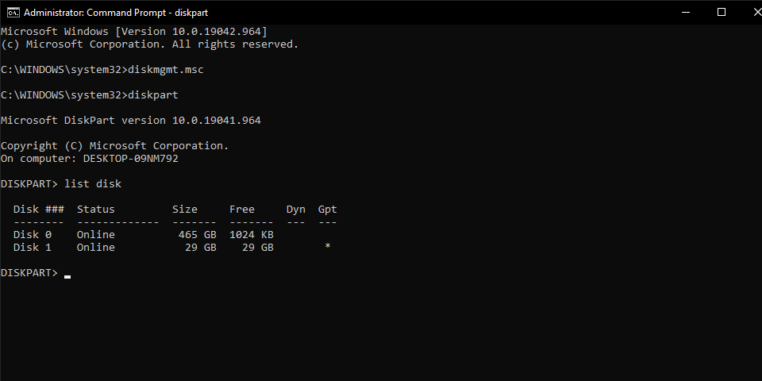
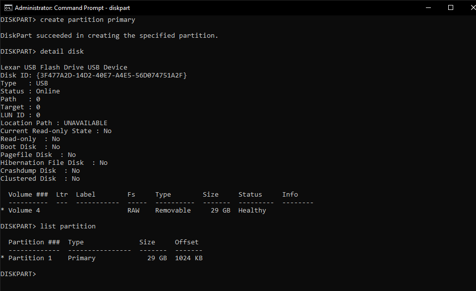

Diskpart is a command line tool that doesn't have as many restrictions as disk manager. It is still limited when working on the `C:` drive, and not a good tool for partition manipulation. To alter the `C:` drive, run it from run from the windows installer or from the [windows PE](/live-sessions/windows-live-session).

This guide will walk you through wiping a disk and creating a single empty partition using the entire drive. 

If you would like to only erase a disk refer to the [diskpart clean factoid](/factoids/diskpart-clean) however, this will not securely erase your data, see the [wiping disks article](/disks/disk-wipe) to do that.

1. To open DiskPart, you will need an elevated command prompt. Just type `diskpart` and DiskPart will load.
2. To identify your disk, type `list disk`, then type `select disk X` where X is the disk number. (Choosing the wrong disk will cause data loss)

    

3. To wipe all partitions from your disk, type `clean`
4. For disk type and partition structure, most cases will want basic and GPT. If this disk needs to be read on older systems, use MBR instead of GPT. Run `convert basic` or `convert gpt` based on what you need.
5. To create the raw partition, run `create primary partition`. If you picked MBR, run `active` after creating the partition.
6. Run `detail disk` and `list partition` to ensure that your disk looks correct and you have both the partition and volume selected. You should have a star next to the volume and partition.

    If either the partition or volume is missing, type `exit`, reconnect your drive and start over.

    If the partition or volume isn't selected (you can tell by the star on the right), type `select partition X` or `select volume X`.

    

7. To format the partition, type `format fs=<filesystem>`. For what file system to use, reference the following:

    <DiskFormats />

    To add a label at this stage, add `label=<label>` to your command.

    If you are using NTFS and want to enable file compression, add `compress` to your format command.

    To significantly speed up the format time, add `quick`.

    A full format command will look something like `format fs=fat32 label=Drive quick`. This will do a quick format with a label of "Drive" and file system of FAT32.

8. To assign a drive letter to the new partition, run `assign letter=X` where X is the letter you choose.
9. Type `exit` to close DiskPart. Your drive is formatted.