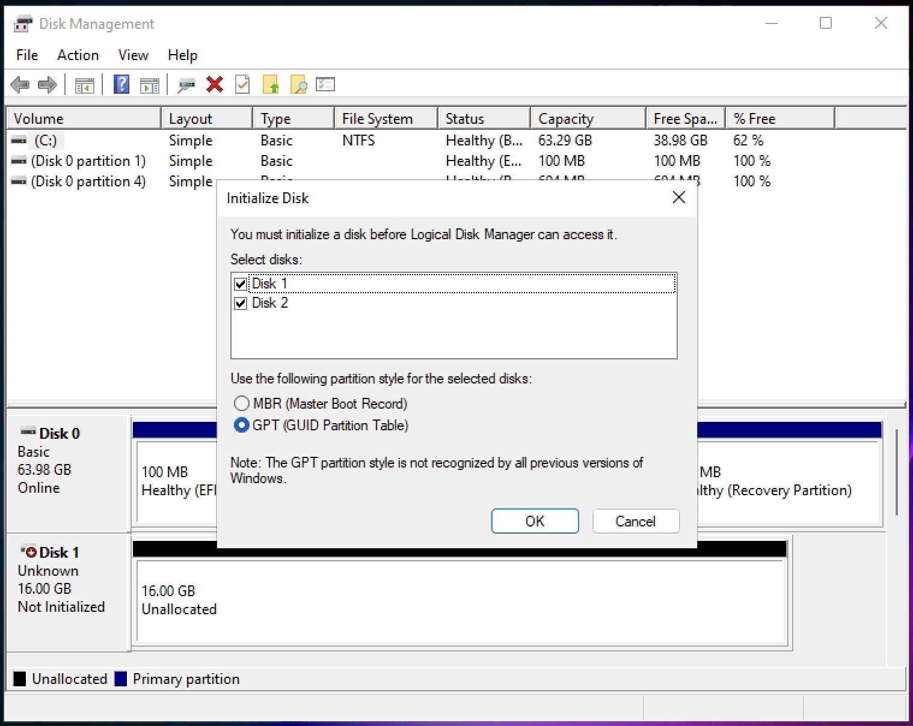
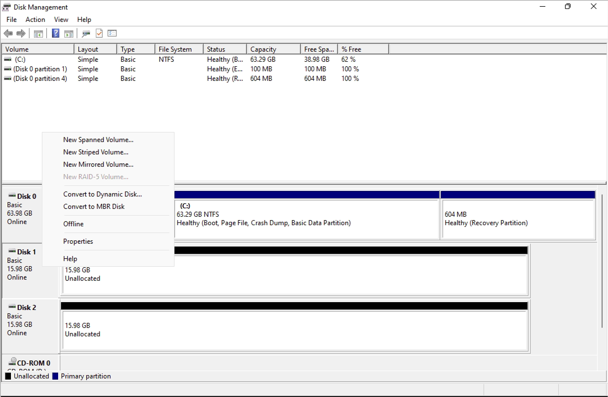
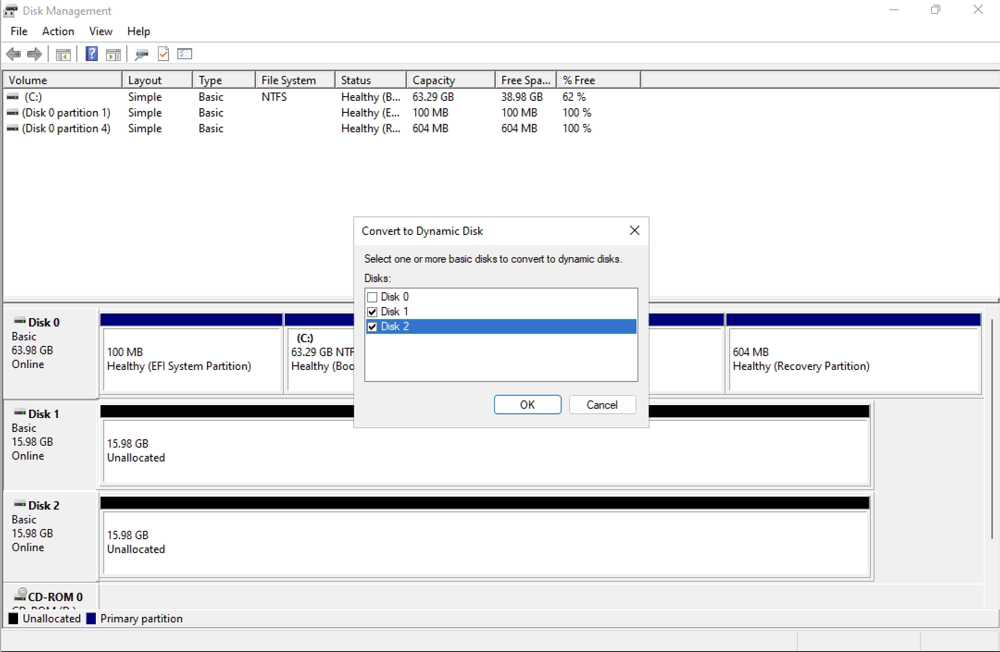
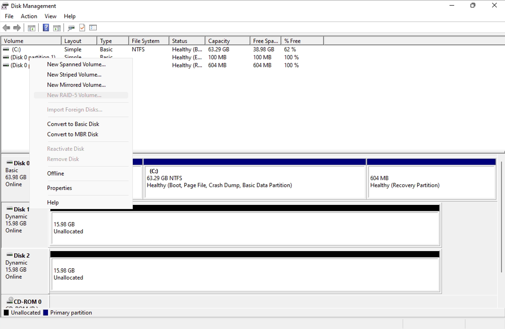
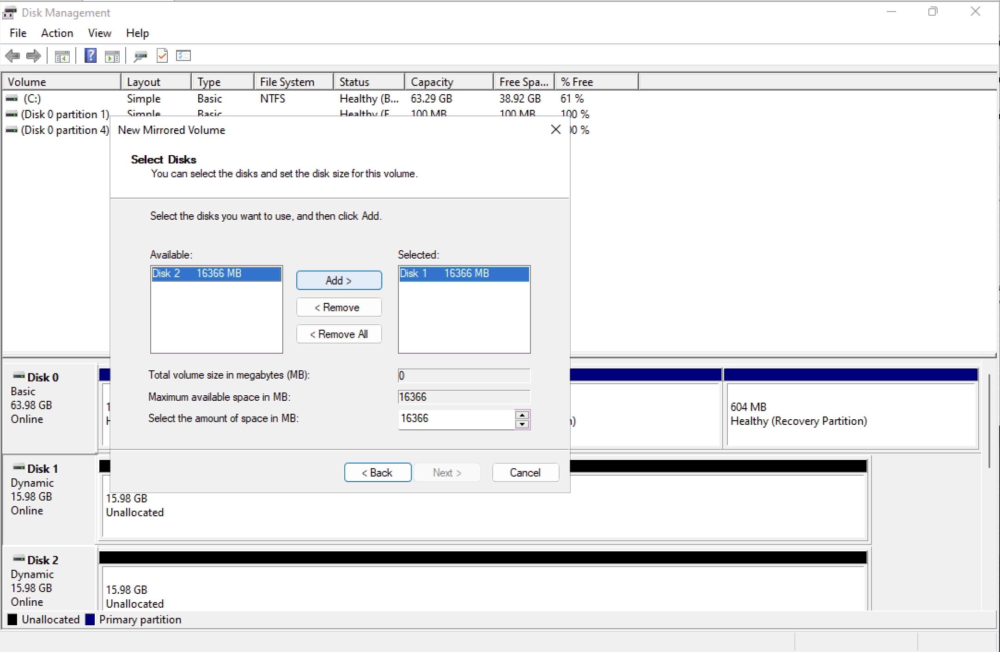
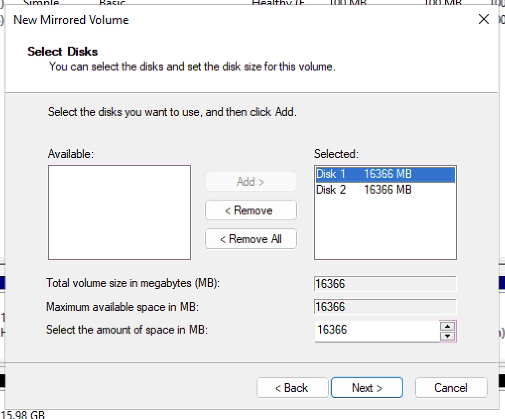
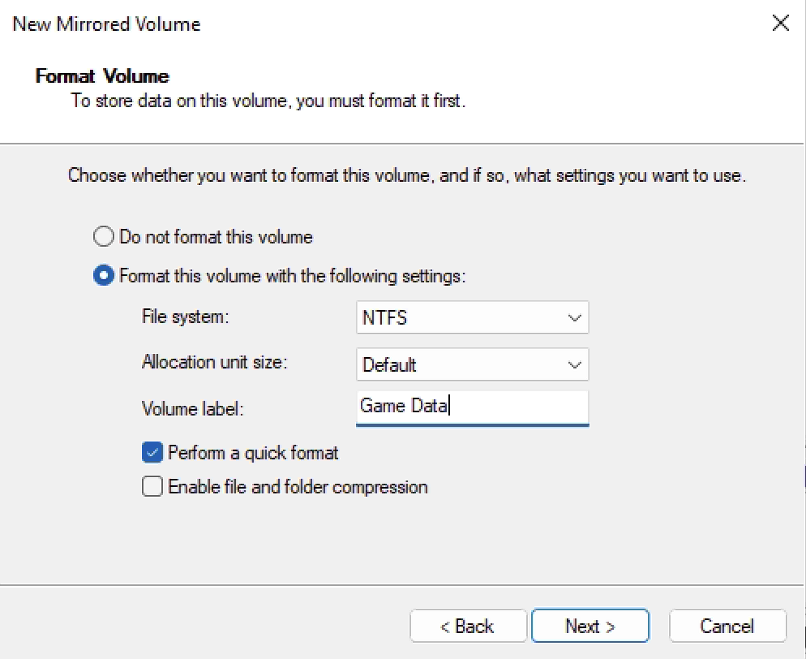

> [!WARNING] Warning
> Any method to accomplish these tasks without data-loss are not supported. The lazy "safe" method is never safe.

Dynamic disks allows you to combine multiple disks into one, allowing you more space on a single drive letter. If you need to upgrade storage it is easy to add another disk without much trouble. 

When multiple disks are combined into one it can be called an "array" or "volume".

## Types of dynamic volumes
### Spanned
Also called `JBOD` this is several disks laid side by side with data written randomly across them. When using '2' 1TB disks, you will have a total of 2TB of space. This is not fault tolerant, losing either disk will result in a loss of all data.

> [!NOTE] Information
> Data is written sequentially, starting at the head of one disk and moving through each disk as they fill

### Striped
Data will be broken in to equal parts and written to every disk in the group. By splitting the data across several disks you improve the read speeds back off the disk. This is typically used for performance gains on HDDs. Like spanning, losing any one disk results in a loss of all data.

### Mirrored
A fault tolerant solution where data is duplicated (mirrored) between disks. This is used to protect against disk failure in a data set but is NOT a backup method by itself. Losing any disk in this array will result in NO data loss, but a new disk must replace the bad.

##  Creating a dynamic disk volume
1. Hit Win+R to open the run dialog and type "diskmgmt.msc"

    > You may be asked to initialize the disk. choose GPT.
 
     

2. By default disks are Basic, we need to change it to Dynamic. Right click the left side where it says "Basic", choose "Convert to Dynamic Disk..."

    

3. A dialog box will pop up asking you which disks you would like to convert to dynamic, select all the disks that you would like to span. 

    > [!WARNING] Warning
    > Do not convert the disk containing C:\  

    > [!WARNING] Warning
    > Converting a disk to dynamic will wipe it

    

4.  Right click the left box again, where it now says "Dynamic". You can choose Spanned, Striped, or Mirrored. Find out about each below before selecting.

    

    > All three options follow the same configuration manager. You can follow the following steps regardless of your chosen layout. 

5. A new wizard will appear, press "next". Two boxes are presented, one disk is in the right box. Every disk that you want added to your volume will need to be moved from the left to the right. Select each disk and choose "Add >".

    

    

6. Select a drive letter for your volume.

    

7. For your format, you most likely want to use NTFS. Tick "Perform a quick format" to avoid (possible hours) of downtime. You can also name the volume, for example "Game Data".

    

8. Conclude by pressing "Finish". Your volume should now appear in "This PC"

    

### References
[Breakdown of dynamic volumes](https://www.linkedin.com/pulse/whats-dynamic-disk-storage-simple-spanned-striped-jasmin-kahriman)