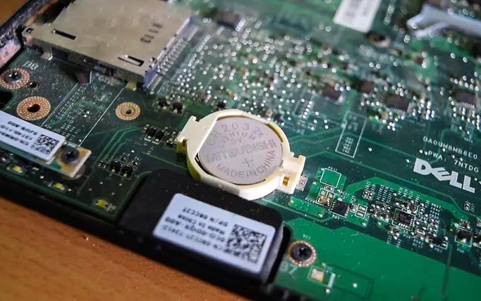
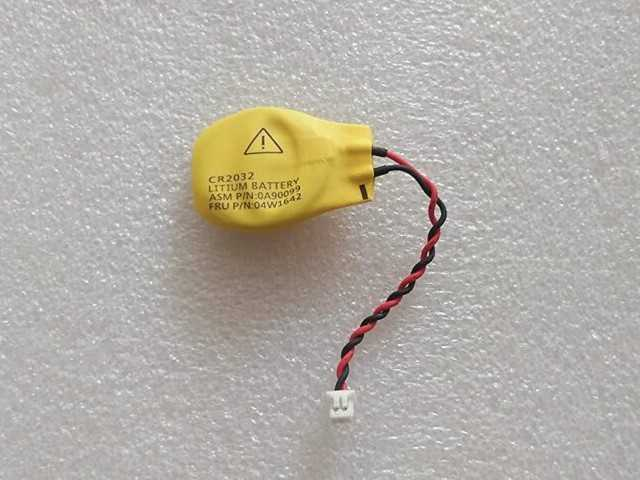
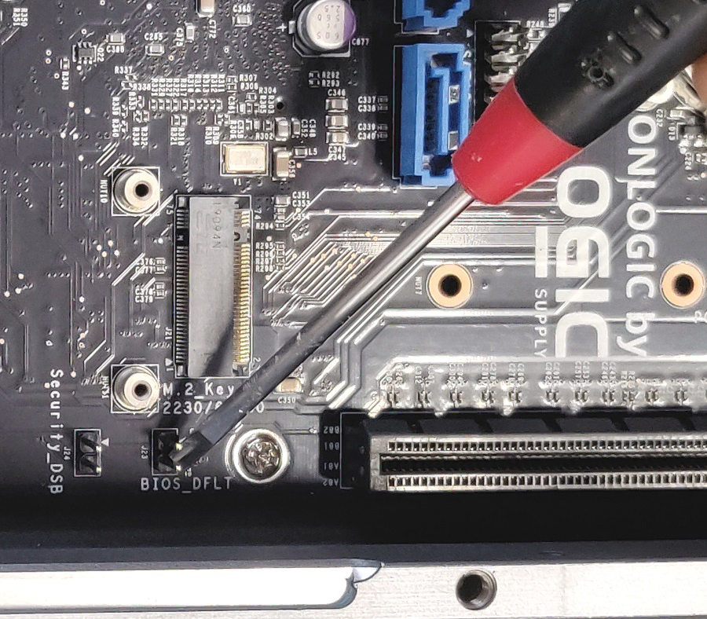

## Method 1: Removing the CMOS battery

1. Unplug PSU power cable from wall, this ensures no power is going to the PC. If on laptop, disconnect the battery from the motherboard as well.

2. Remove CMOS battery. This is a small 'watch battery' in your motherboard (see below).

	

	 > [!NOTE] Information
     > 
	 > Some laptops may lack a dedecated CMOS battery but use the main battery for its functionality, other laptops may have the battery covered like this: 
	

3. Press and hold PC power button for 30 seconds, this clears out any remaining charge in your PC.

4. Reinsert the CMOS battery, reconnect power and try starting the machine.

## Method 2: Using the CMOS Clear pins
The CMOS Clear pins are present on many desktop and even some laptop motherboards. If you can locate the CMOS clear pins (Note: Different motherboards label the CMOS clear pins differently, ASUS labels it as CLRTC, Gigabyte labels it CMOS_CLEAR, etc.)

1. Unplug PSU power cable from wall, this ensures no power is going to the PC. If on laptop, disconnect the battery from the motherboard as well.

2. Locate and identify the CMOS clear pins. Note that it may differ in name from manufacturer to manufacturer of the motherboard.

3. Using a screwdriver, short the two pins by inserting the screwdriver between the two pins (see below).

	

4. Hold the screwdriver in place four roughly 20-30 seconds. Press the power button multiple times while holding the screwdriver in place. Once the time expires, remove the screwdriver, reconnect power, and try restarting the machine.
