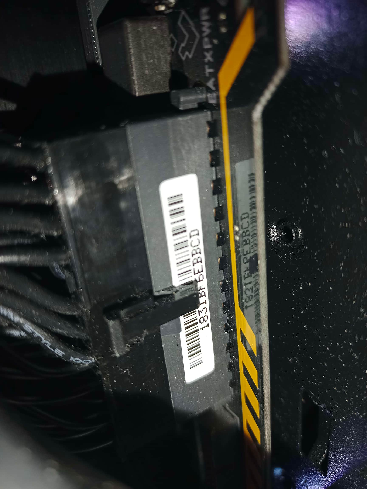

Please follow the guide to take good hardware photos, for easier identification of the problem at hand. **Remember to turn on flash when taking photos!**

Remember to ensure the photos are clear and that parts are easy to distinguish (i.e. not blurry), using the reference images as a guide:

## 1 - The center of the Motherboard:

> Ensure that the entire motherboard photo is in the frame, and connections mostly visible.

## 2 - Side angle Photo of the 24-Pin Power Cable to the Motherboard:

## 3 - Graphics Card Power Cable (PCI Express cables):

## 4 - Photos of the RAM modules in the socket (top and bottom):

> Ensure that the photos include the position of the tabs at the top of the RAM slot

## 5 - SATA Connections + General Front IO connections + M.2 drive connections:

> Take as many photos as you can with regards to these connections, as some connections, such as SATA are on the side.

## 6 - CPU Power Connection:

