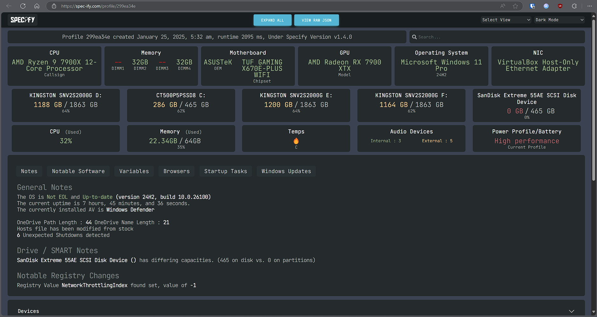
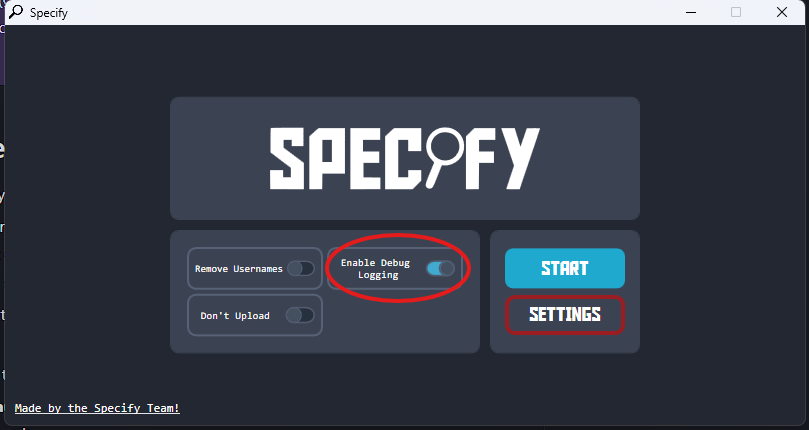

Spec-Ify is a custom made, [open-source](https://github.com/Spec-ify/specify) windows app that gathers system information like Operating System, Hardware specifications, and Software information/errors to help us troubleshoot your computer.

> [!IMPORTANT] Important!
>
> Nothing sensitive is included in the report, we will not ask you to share private information. Do note that if you wish to hide your windows username, enable remove usernames in settings brefore clicking start.

> [!INFORMATION] Data Retention Policies
>
> In compliance with [GDPR (General Data Protection Regulation)](https://gdpr-info.eu/), the report will **be automatically deleted after 24 hours**. For more information about our data retention policies, please refer to our [README on GitHub](https://github.com/Spec-ify/specify/blob/main/README.md).

### How to use Spec-Ify

1. **Download** the Spec-Ify tool from the following link: https://spec-ify.com/download
2. **Run** the Spec-Ify.exe program.
    - If a User Account Control (UAC) window pops up, press yes. If a Windows Smartscreen window pops up, select "More Info" and then "Run Anyway".
3. **(Optional)** - Select Settings and enable the `Remove Username` option if you wish to redact your computer name.
4. Click on **Start**, wait for the program to complete scanning the system.
5. Once it is done, it will **automatically open a link and copy it to your clipboard**. Click "Close Program" at the end to exit.
6. Paste this link in the channel you are getting support from.

An example of a Spec-Ify report:

### Issues running Spec-Ify

If Spec-Ify fails to produce a link, or crashes, re-run this tool, but enable the **Debug Logging** option in settings.

