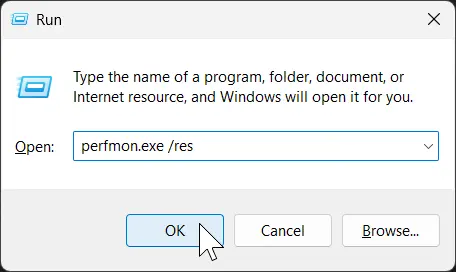
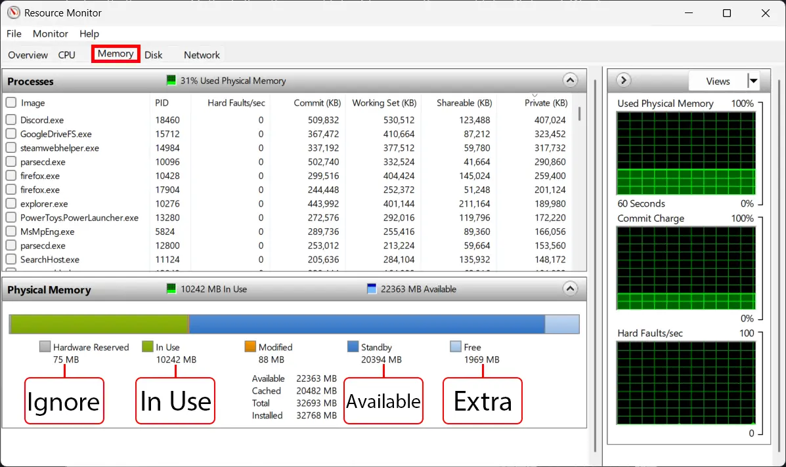

There is a very simple & quick way of seeing if you actually are running low on RAM before buying extra. There’s a misconception that adding RAM makes a machine faster. This is not true UNLESS the machine can use more RAM than is already installed. Adding RAM to a machine that isn’t already using it all does nothing whatsoever.

Firstly, launch all of the apps that you generally have going. Open a few browser tabs, get your email going, etc. Aim for an average session that’s a bit on the intensive side, but don’t open every app on your machine. If you have an intensive game you’re trying to run, open that. The example below is a laptop that’s running Outlook, IE with several tabs, Chrome with several tabs, Notepad, Windows Explorer, a couple of chat apps, Dropbox and Snag-It. Then:

**Open Resource Monitor**
1. Press Win + R to launch the run box

2. Type `perfmon.exe /res` into the box, and hit Enter

   

3. Go to the Memory tab

There are 5 different sections of memory usage on the bar graph, but only 3 of them are really important to you.
## What to ignore
The first section, in gray, labeled Hardware Reserved, is RAM that hardware itself uses and there’s nothing you can do about this, so it’s not important. This amount will generally be pretty low (a large size here usually indicates that you’ve got more than 4 GB in a 32-bit machine). Ignore this section.

The third section, in orange, labeled Modified, is not very important because this amount is generally low. This is RAM that’s in use by low priority tasks that can be quickly released for other use. Ignore this as well.
## The Second Section

This section, in green, labeled In Use, is the total amount of physical RAM that your machine is currently using for open programs, the “active memory“. In the graphic linked above, the machine has 3 GB of actively used RAM.
## The Fourth Section

This section, in dark blue, labeled Standby, is RAM that the system is using for caching files, but that the programs on the system do not actively need for running. This is memory that’s ready to be freed for use at any time for whatever application needs it next, if the next section runs out. In this example, there’s 3 GB of RAM being used for cache.
## The Fifth Section

This section, in light blue, labeled Free, is empty RAM. The name “Free” is kind of misleading, as this is more like wasted RAM. The memory in this section is the amount that Windows is just ignoring because it has no use for it. It’s not being used at all, not even as a cache – it’s just sitting there doing nothing. In the example above, there’s 2 GB of RAM being used for nothing.

## What to look for
If the Free section is very small (<500 MB) then your computer is making use of almost all of the available memory (some completely free memory is required). It could likely benefit from having additional RAM installed. Note that your OS prioritizes what to put into the Standby cache and therefore growing Standby has diminishing returns.

If both the Free and Standby sections are small, then your computer is running very low on memory. By default, most systems will start using the disk instead of the RAM for storing program memory (basically, the opposite of Standby). This is extremely slow, and can reduce the lifespan of SSDs. If this is the case, you should purchase more RAM or close programs to free up some memory.

---

## Conclusions

If someone were to show this display and ask if they need more RAM then the answer would be no. The person has more installed than the machine is using. In this example the machine is only actively using ~3 GB with another ~3 GB on cache/standby, and ~2 GB doing nothing at all. Having 4 GB in the machine would be acceptable, and having 6 GB would be just enough for this session to run at its optimal speed. It’s got 8 GB installed (see the line highlighted in yellow), so ~2 GB is ‘wasted’ because Windows simply has no use for it when running only these programs. Adding more RAM to this machine, for this workload, would be nothing but a waste of money.

A well-optimized computer will have a large amount of “Standby” and a decent amount of “Free” when running its typical workload.

*This guide is copied from [SlickDeals](https://slickdeals.net/e/4922990-how-to-know-if-you-need-more-ram) and was originally written by /u/jeffbx*
